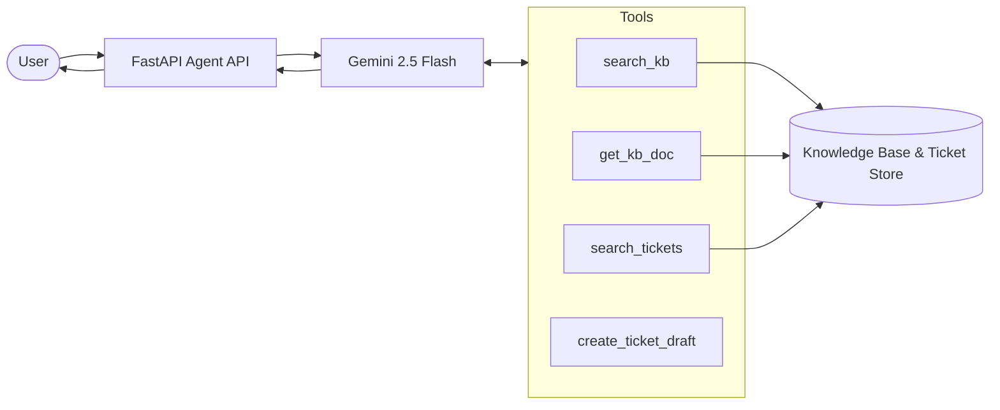

# MCP Gemini Support Agent

## Demo

### Enterprise Support Agent UI


The Streamlit UI allows users to submit support requests, view citation-grounded responses, inspect retrieved evidence, and review tool invocation details.

### Live Cloud Deployment

The application is deployed on Google Cloud Run as a multi-service architecture consisting of:

- Streamlit UI
- FastAPI Agent API
- Tool Server

Cloud Run provides automatic HTTPS endpoints, autoscaling, monitoring, and serverless deployment capabilities.

---

## Overview

Enterprise IT support teams handle large volumes of repetitive requests related to VPN access, authentication failures, software installation, permissions, and account management. Relevant information is often distributed across knowledge bases, internal documentation, and historical support tickets, making issue resolution time-consuming and inconsistent.

This project implements an Enterprise AI Support Agent powered by Gemini Function Calling and FastAPI. The agent retrieves enterprise knowledge, searches historical support cases, generates citation-grounded responses, and automatically creates ticket drafts when available evidence is insufficient.

The system demonstrates how LLM agents can be integrated into enterprise support workflows while improving reliability, traceability, and operational efficiency.

---

## Technical Highlights

- Built an enterprise AI support agent using Gemini Function Calling and FastAPI
- Implemented knowledge-base retrieval, historical ticket search, and ticket draft generation workflows
- Developed citation-grounded response generation with evidence retrieval
- Designed structured JSON response schemas using Pydantic validation
- Implemented structured logging for observability, including latency, tool usage, citation counts, and retry metrics
- Developed an automated evaluation framework for tool routing, citation validation, and ticket workflow verification
- Containerized the application using Docker and Docker Compose
- Deployed a multi-service architecture on Google Cloud Run with autoscaling support

---

## Key Features

### Knowledge Base Retrieval

- Searches enterprise support articles
- Retrieves relevant troubleshooting steps
- Returns citation-backed responses

### Full Document Retrieval

- Retrieves complete knowledge-base documents when additional context is required
- Supports policy and guide summarization

### Historical Ticket Search

- Finds similar resolved support cases
- Surfaces previous resolutions and troubleshooting paths

### Ticket Draft Creation

- Automatically creates support ticket drafts when evidence is insufficient
- Prevents unsupported or hallucinated recommendations

### Reliability, Observability & Validation

- Gemini Function Calling
- Pydantic response validation
- Automatic retry handling for API failures
- Structured JSON outputs
- Structured logging for monitoring and debugging
- Latency and tool-usage tracking

### Evaluation Framework

- Automated evaluation suite
- Tool-routing validation
- Citation validation
- Ticket workflow validation

---

## System Architecture



The agent uses Gemini Function Calling to interact with a tool server that provides knowledge-base retrieval, historical ticket search, full document retrieval, and ticket draft creation capabilities.

---

## Agent Workflow

1. User submits a support request

2. Gemini determines which tool(s) to invoke

3. `search_kb()` retrieves relevant support evidence

4. `get_kb_doc()` is called when broader document context is needed

5. `search_tickets()` retrieves similar historical cases

6. `create_ticket_draft()` is used when evidence is insufficient

7. Agent returns:
   - Grounded answer
   - Citations
   - Confidence score
   - Next actions

---

## Technology Stack

### Frontend

- Streamlit

### Backend

- Python
- FastAPI
- Uvicorn

### LLM

- Gemini 2.5 Flash
- Function Calling

### Validation

- Pydantic

### Deployment

- Docker
- Docker Compose
- Google Cloud Run

### Monitoring

- Google Cloud Logging
- Structured JSON Logs

### Testing

- Automated Evaluation Framework

### Data Layer

- ChromaDB
- JSON Knowledge Base
- Historical Ticket Store

---

## Cloud Deployment

The system is deployed on Google Cloud Run using a containerized multi-service architecture.

### Services

| Service | Description |
|----------|----------|
| Streamlit UI | User-facing support interface |
| Agent API | Gemini-powered orchestration layer |
| Tool Server | Retrieval and ticketing tools |

### Deployment Features

- Docker-based deployment
- Google Cloud Run serverless hosting
- Automatic HTTPS endpoints
- Autoscaling support
- Cloud Logging integration
- Service isolation across UI, API, and Tool layers

### Autoscaling Configuration

| Service | Min Instances | Max Instances |
|----------|----------|----------|
| UI | 0 | 2 |
| Agent API | 0 | 3 |
| Tool Server | 0 | 3 |

Cloud Run automatically scales services based on incoming traffic while scaling to zero during idle periods to reduce cost.

---

## Evaluation

The project includes an automated evaluation framework for measuring agent behavior and workflow correctness.

### Evaluation Coverage

- Knowledge-base retrieval
- Historical ticket retrieval
- Ticket draft creation
- Citation generation
- Tool routing behavior
- API reliability

### Example Metrics

| Metric | Result |
|----------|----------|
| Total Test Cases | 20 |
| Logic Pass Rate | 100% |
| Tool Validation | Supported |
| Citation Validation | Supported |
| Retry Handling | Supported |
| Structured Output Validation | Supported |

**Note:** Occasional failures may occur due to external Gemini API rate limits or temporary service availability issues. Automatic retry logic is implemented to improve reliability.

---

## Observability

The system emits structured JSON logs for monitoring and debugging.

Captured metrics include:

- Query latency
- Tool invocations
- Citation count
- Retry count
- Ticket creation events
- Confidence score

Example log:

```json
{
  "event": "agent_response",
  "query": "VPN authentication failed",
  "tool_calls": ["search_kb"],
  "citation_count": 2,
  "ticket_created": false,
  "latency_ms": 1874,
  "retry_count": 0,
  "confidence": 0.85,
  "model": "gemini-2.5-flash"
}
```

When deployed to Cloud Run, logs are automatically collected and visualized through Google Cloud Logging.

---

## Running the Application

### Local Development

Build and start all services:

```bash
docker compose up --build
```

### Streamlit UI

Open:

```text
http://localhost:8501
```

The UI allows users to:

- Submit support requests
- View grounded responses
- Inspect citations
- Review confidence scores
- View tool invocation details

### Agent API

```text
http://localhost:8000
```

### Swagger API Documentation

```text
http://localhost:8000/docs
```

### Tool Server

```text
http://localhost:7001
```

---

## Future Improvements

- Persistent ticket storage using Firestore or Cloud SQL
- Multi-turn conversation memory
- Retrieval strategy comparison and ranking evaluation
- Integration with Jira or ServiceNow
- Advanced monitoring dashboards and alerting
- Custom domain and authentication support

---

## Project Objectives

This project demonstrates:

- Enterprise AI Agent design
- Retrieval-Augmented Generation (RAG)
- Function Calling orchestration
- Citation-grounded response generation
- Automated evaluation methodologies
- Structured logging and observability
- Docker containerization
- Cloud-native deployment using Google Cloud Run
- Autoscaling serverless architectures