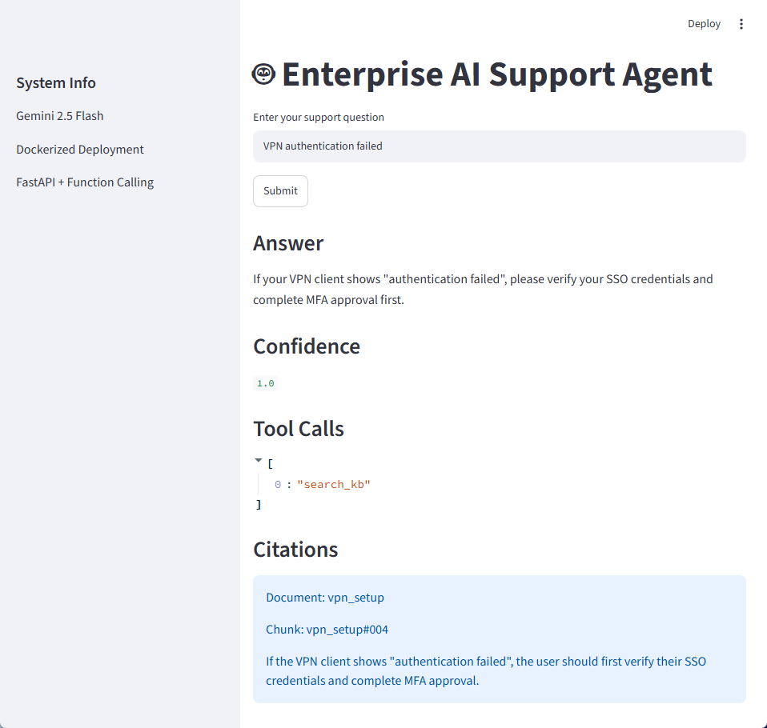

# MCP Gemini Support Agent

## Demo

### Enterprise Support Agent UI



The Streamlit UI allows users to submit support requests, view citation-grounded responses, inspect retrieved evidence, and review tool invocation details.

---

## Overview

Enterprise IT support teams handle large volumes of repetitive requests related to VPN access, authentication failures, software installation, permissions, and account management. Relevant information is often distributed across knowledge bases, internal documentation, and historical support tickets, making issue resolution time-consuming and inconsistent.

This project implements an Enterprise AI Support Agent powered by Gemini Function Calling and FastAPI. The agent retrieves enterprise knowledge, searches historical support cases, generates citation-grounded responses, and automatically creates ticket drafts when available evidence is insufficient.

The system demonstrates how LLM agents can be integrated into enterprise support workflows while improving reliability, traceability, and operational efficiency.

---

## Technical Highlights

- Built an enterprise support agent using Gemini Function Calling and FastAPI
- Implemented knowledge-base retrieval and historical ticket search workflows
- Added automatic ticket draft generation for unresolved issues
- Designed a structured JSON response schema using Pydantic
- Developed an automated evaluation framework for tool-routing and citation validation
- Containerized the multi-service architecture using Docker Compose

---

## Key Features

### Knowledge Base Retrieval

- Searches enterprise support articles
- Retrieves relevant troubleshooting steps
- Returns citation-backed responses

### Full Document Retrieval

- Retrieves complete knowledge-base documents when additional context is required
- Supports policy and guide summarization

### Historical Ticket Search

- Finds similar resolved support cases
- Surfaces previous resolutions and troubleshooting paths

### Ticket Draft Creation

- Automatically creates support ticket drafts when evidence is insufficient
- Prevents unsupported or hallucinated recommendations

### Reliability & Validation

- Gemini Function Calling
- Pydantic response validation
- Automatic retry handling for API failures
- Structured JSON outputs

### Evaluation Framework

- Automated evaluation suite
- Tool-routing validation
- Citation validation
- Ticket workflow validation

---

## System Architecture


The agent uses Gemini Function Calling to interact with a tool server that provides knowledge-base retrieval, historical ticket search, full document retrieval, and ticket draft creation capabilities.

---

## Agent Workflow

1. User submits a support request

2. Gemini determines which tool(s) to invoke

3. `search_kb()` retrieves relevant support evidence

4. `get_kb_doc()` is called when broader document context is needed

5. `search_tickets()` retrieves similar historical cases

6. `create_ticket_draft()` is used when evidence is insufficient

7. Agent returns:
   - Grounded answer
   - Citations
   - Confidence score
   - Next actions

---

## Technology Stack

### Frontend

- Streamlit

### Backend

- Python
- FastAPI
- Uvicorn

### LLM

- Gemini 2.5 Flash
- Function Calling

### Validation

- Pydantic

### Deployment

- Docker
- Docker Compose

### Testing

- Automated Evaluation Framework

### Data Layer

- JSON Knowledge Base
- Historical Ticket Store

---

## Evaluation

The project includes an automated evaluation framework for measuring agent behavior and workflow correctness.

Evaluation dimensions include:

- Tool routing accuracy
- Citation generation
- Ticket draft creation
- API reliability
- Retry handling

### Example Metrics

| Metric | Value |
|----------|----------|
| Total Test Cases | 20 |
| Tool Validation | Supported |
| Citation Validation | Supported |
| Retry Handling | Supported |
| Structured Output Validation | Supported |

---

## Running the Application

Build and start all services:

```bash
docker compose up --build
```

### Streamlit UI

Open:

```text
http://localhost:8501
```

The UI allows users to:

- Submit support requests
- View grounded responses
- Inspect citations
- Review confidence scores
- View tool invocation details

### Agent API

```text
http://localhost:8000
```

### Swagger API Documentation

```text
http://localhost:8000/docs
```

### Tool Server

```text
http://localhost:7001
```

---

## Future Improvements

- Multi-turn conversation memory
- Cloud deployment (Cloud Run / ECS)
- Vector database retrieval
- LLM-based grounding evaluation
- Integration with real ticketing systems